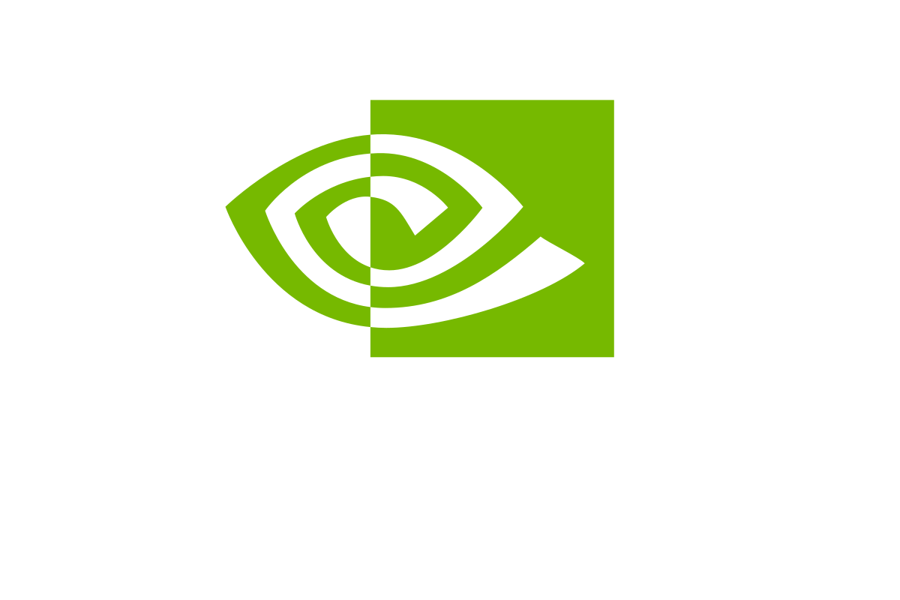
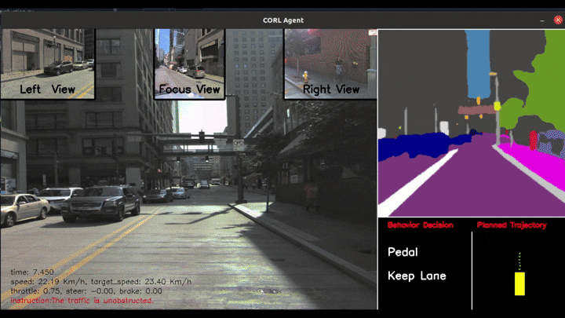

<div align="center">

<h1>
ProFounDrive: Toward Ever-Evolving Autonomous Driving: Continual Reinforcement Learning with Onboard Foundation Models
</h1>

<p align="center">
<!-- <a href=https://arxiv.org/abs/2412.09951></a> -->

<!-- [](https://arxiv.org/abs/2512.01830) -->
<!-- [](https://huggingface.co/wyddmw/OpenREAD/tree/main) -->
<!-- [](https://huggingface.co/datasets/wyddmw/OpenREAD) -->

</p>

Wenhui Huang<sup>1,2</sup>, Xiangkun He<sup>1</sup>, Songyan Zhang<sup>1</sup>, Yanxin Zhou<sup>1</sup>, Heng Yang<sup>2</sup>, Yuxiao Chen<sup>3</sup>, Marco Pavone<sup>3,4†</sup>, Chen Lv<sup>1†</sup>

Nanyang Technological University<sup>1</sup>, Harvard University<sup>2</sup>, NVIDIA Research, <sup>3</sup>, 
Stanford University, <sup>4</sup>

<table>
<tr>
  <td></td>
  <td></td>
  <td></td>
  <td></td>
</tr>
</table>


†Corresponding Author

<image src="./asset/blue_print_v8.png" width="720" /><br>
An overview of the framework of our ProFounDrive.
</div>

## ✨Capabilities

### Argoverse 2



### Carla CoR Cases (Jaywalker and Drive into Gas station)


### Campus Post-Deployment Daily Driving


An overview of the capability of our proposed OpenREAD, a vision-language model tailored for autonomous driving by reinforcement learning with GRPO. Besides the trajectory planning, our OpenREAD is also capable of providing reasoning-enhanced response for open-ended scenario understanding, action analysis, *etc*.

## 🦙 Data & Model
Our ProFounDrive is built upon the [MobileVLM V2](https://github.com/Meituan-AutoML/MobileVLM) and [GPT](https://huggingface.co/openai-community/gpt2-xl), and finetuned on a mixture of datasets including LingoQA, DRAMA, and Carla datasets. Our ProFounDrive is now available at [huggingface](https://huggingface.co/Oscar-Huang/ProFounDrive-MobileVLM). Enjoy playing with it!

<image src="./asset/town03_round_traffic1.png" width="600"/>

To follow the continual learning protocol, we collected diverse route data from CARLA using only high-quality demonstrations and categorized them into three domains: urban, highway, and rural. For the convenience of reproducing ProFounDrive, we also provide the minimal dataset required for training and evaluating the proposed CORL. All datasets are available [here](https://huggingface.co/Oscar-Huang/CarlaCORL).

## 🛠️ Install

1. Clone this repository and navigate to OpenREAD folder
  ```bash
  git clone git@github.com:OscarHuangWind/ProFounDrive.git
  cd ProFounDrive
  ```

2. Create the environment
  ```Shell
  conda create env -f profoundrive_environment.yaml
  conda activate profoundrive
  ```

## 🪜 Training & Evaluation

### Datasets
The datasets used to train ProFounDrive are as follows:

#### Scene Understanding
* [LingoQA](https://github.com/wayveai/LingoQA)
* [DRAMA](https://usa.honda-ri.com/drama)

The datasets are organized in the following structure:
```
data
├── LingoQA
│   ├── action
│   │   └── images
│   ├── evaluation
│   │   │── images
│   │   └── val.parquet
│   ├── scenery
│   │   └── images
│   ├── training_data.json
│   └── evaluation_data.json
├── DRAMA
│   ├── 2020-0127-132751
│   │   ├── 000202
│   │   ├── 000739
│   ├── 2020-0228-150133
│   │   │── 000165
│   │   └── 000397
│   ├── ...
│   │
│   ├── drama_train.json   
```

We refer the scene-understanding training and evaluation procedure to [WiseAD](https://github.com/wyddmw/WiseAD), which serves as the prior work to ProFounDrive.

#### Decision-Making and Trajectory Planning
* [Carla](https://huggingface.co/Oscar-Huang/CarlaCORL)

The datasets are organized in the following structure:
```
data
├── carlacorl
│   ├── urban
│   │   │── weather-0
│   │   │   │── data(train&test)
│   │   │   │     └── routes
│   │   │   │           │── rgb(multi-view)
│   │   │   │           │── action
│   │   │   │           └── measurements
│   │   │   │── validation
│   │   │   │── failed
│   │   │   └── under_perform
│   │   │── weather-1
│   │   │── ...
│   │   │── weather-8
│   │   │── weather-minimal
│   │   └── weather-debug
│   ├── highway
│   │   │── weather-0
│   │   │── weather-1
│   │   │── ...
│   │   │── weather-8
│   │   │── weather-minimal
│   │   └── weather-debug
│   ├── rural
│   │   │── weather-0
│   │   │── weather-1
│   │   │── ...
│   │   │── weather-8
│   │   │── weather-minimal
│   │   └── weather-debug 
```

### CORL Training for decision and planning
1. Define the training params in train.sh

    * DATASET="min-3-domain" # or 3-domain
    * LEARNING_MODE="Split-sequential" 
    
      \# We partition the data into training and validation sets at a 9:1 ratio, applying this split consistently across all sequential tasks.
    * EPOCHS="50 30 30" 
    
      \# We train ProFounDrive for a greater number of epochs on the first domain to adequately optimize the connector and task-specific head.
    * DATA_PATH="your data path"
    * OUTPUT_DIR="your output directory"
    * WANDBKEY="your wandb key"

      \# Modify the wandb-related params in config file: /your workspace/ProFounDrive/corl/corl_config.py

2. Play with the configs in config file:/your workspace/ProFounDrive/corl/corl_config.py
    
    * image type: rgb or segmentation
    * number of tasks: domain counts
    * DSP parameters: pool size, prompt length, prompt types, prompt loss
    * Backbone Model: MobileVLM-based or GPT-based
    * Control Parameters: PID, max speed, and so on
  
    ⚠️ We recommend that beginners adopt the default settings, as they provide a reliable baseline for achieving consistent results.


3. Run the scripts  
  ```bash
  cd /your_workspace/ProFounDrive/leaderborad/scripts
  bash train.sh
  ```
  * This will trigger the automatic download of MobileVLM V2, Mask2Former and the other necessary models. 

### CORL Open-loop Evaluation
1. Define the evaluation-related param in train.sh

    * MODE="eval" # "train"
    * PRETRAIN="pretrain" #"scratch"
    * DATASET="min-3-domain"
    * LEARNING_MODE="Split-sequential"

2. Provide the ckpt path in config file:/your workspace/ProFounDrive/corl/corl_config.py
    * model_path = 'your ckpt'

3. Run the evaluation:
  ```bash
  cd /your_workspace/ProFounDrive/leaderborad/scripts
  bash train.sh
  ```

### CORL Closed-loop Evaluation
1. Download and setup the Carla simulator
  ```bash
  chmod +x setup_carla.sh
  ./setup_carla.sh
  easy_install carla/PythonAPI/carla/dist/carla-0.9.10-py3.7-linux-x86_64.egg
  ```
Note: we choose the setuptools==41 to install because this version has the feature easy_install. After installing the carla.egg you can install the lastest setuptools to avoid No module named distutils_hack.

2. Run the Carla simulator:
  ```bash
  cd your carla directory
  carla/CarlaUE4.sh --world-port=2000 -opengl
  ```
3. Open another terminal and setup the environmental variables:
  ```bash
  export CARLA_ROOT=${1:-/your carla directory/carla}
  export CARLA_SERVER=${CARLA_ROOT}/CarlaUE4.sh
  export PYTHONPATH=${CARLA_ROOT}/PythonAPI:$PYTHONPATH
  export PYTHONPATH=${CARLA_ROOT}/PythonAPI/carla:$PYTHONPATH
  export PYTHONPATH=${CARLA_ROOT}/PythonAPI/carla/dist/carla-0.9.10-py3.7-linux-x86_64.egg:$PYTHONPATH

  export SRC_ROOT=${2:-/your work space/ProFounDrive}
  export PYTHONPATH=$PYTHONPATH:${SRC_ROOT}
  export PYTHONPATH=$PYTHONPATH:${SRC_ROOT}/corl
  export PYTHONPATH=${SRC_ROOT}/leaderboard:$PYTHONPATH
  export PYTHONPATH=$PYTHONPATH:${SRC_ROOT}/leaderboard/team_code
  export PYTHONPATH=$PYTHONPATH:${SRC_ROOT}/scenario_runner
  export LEADERBOARD_ROOT=${SRC_ROOT}/leaderboard
  ```

✅ For the convenience, we recommend write these settings to the ~/.bashrc file.

4. Launch the ProFounDrive agent and run the evaluation:
  ```bash
  cd your workspace/ProFounDrive/leaderboard/scripts
  bash run_evaluation.sh
  ```

## 🔨 TODO LIST
- [ ] Release hugging face checkpoints.
- [✓] Release decision-making and trajectory data.
- [✓] Release training code.
- [✓] Release evaluation code.

## Acknowledgment

We appreciate the awesome open-source project of [MobileVLM](https://arxiv.org/pdf/2402.03766), [interfuser](https://github.com/opendilab/InterFuser), [Mask2Former](https://github.com/facebookresearch/Mask2Former).


## ✏️ Citation

If you find OpenREAD is useful in your research or applications, please consider giving a star ⭐ and citing it with the following BibTeX:

```
@article{huang2025profoundrive,
  title={Toward Ever-Evolving Autonomous Driving: Continual Reinforcement Learning with Onboard Foundation Models},
  author={Wenhui Huang and Xiangkun He and Songyan Zhang and Yanxin Zhou, Heng Yang and Yuxiao Chen and , Maroco Pavone, Chen Lv},
  journal={to be updated},
  year={2025}
}
```

```
@article{zhang2024wisead,
  title={WiseAD: Knowledge Augmented End-to-End Autonomous Driving with Vision-Language Model},
  author={Zhang, Songyan and Huang, Wenhui and Gao, Zihui and Chen, Hao and Lv, Chen},
  journal={arXiv preprint arXiv:2412.09951},
  year={2024}
}
```
